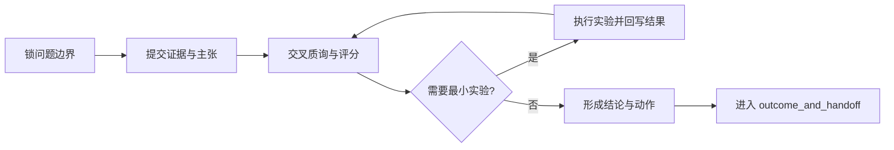

# Brainstorm 要成为决策基础设施：自解释与专家论坛的可执行闭环

一次 brainstorm 真正把人拖回原点，常见原因是问题边界、证据、争议和交接混在了一起。第一场会先聊目标读者，第二场会回头重问“这件事到底给谁看”，第三场会开始补链接，到了 handoff 时只剩一个谁都不敢接的结论。讨论看起来很多，系统里真正可复用的东西很少。

这篇文章只解决这一类返工：讨论已经发生过，参与者也投入了时间，后来者却仍然要从头重建上下文。判断标准不复杂。新参与者能否在 10 分钟内复原边界，会改变结论的争议是否只留在一个地方，执行方拿到的动作是否带着证据和适用范围。如果这三件事做不到，brainstorm 仍然只是一次高质量聊天。

下文把问题拆成两层。第一层是自解释，让问题边界和证据落到固定载体里。第二层是专家论坛，让会改变结论的争议只在一个可审计的位置收敛。两层都落下去，讨论结果才有资格进入实验和 handoff。

## 自解释解决的是重建成本

一轮典型返工通常是这样发生的：第一场会已经说清目标读者，第二场会又重新争论“这件事到底给谁看”，第三场会开始补证据，最后 `outcome` 里只剩一个谁都不敢接的结论。问题不在大家不努力，而在于边界、备选路线、争议和交接全都留在会话里。后来者要理解发生过什么，只能重新翻聊天记录。

要把这笔成本降下来，最直接的办法是把四类信息分开存放。这里说的 single source of truth，也就是单一事实来源，指的是四类信息各归其位。`input_and_qa.md` 放问题边界，`finding_and_analyze.md` 放备选路线，`expert_forum.md` 放争议收敛，`outcome_and_handoff.md` 放动作交接。四个载体还在，后来者面对的就是一个已经分区的决策现场。

| 支柱 | 固定载体 | 通过信号 |
| --- | --- | --- |
| 连续性 | `input_and_qa.md` + `finding_and_analyze.md` | 新参与者 10 分钟内可复原边界 |
| 收敛性 | `expert_forum.md` | 关键争议不再旁路到群聊 |
| 验证性 | `references/` + `experimental/` | 结论可回链到证据与实验 |
| 交接性 | `outcome_and_handoff.md` | 执行方可直接领取 next action |

四份文件是从失败模式里长出来的最小接口。边界和证据混在一起，会让后来者重复拆题。争议和动作混在一起，会让执行方拿到一句没有适用范围的结论。把这四类信息拆开之后，讨论才会把火力集中到真正有分歧的地方，不再一遍遍回到“我们到底在讨论什么”。

这套接口当然有成本。每次都维护四份文件，会多出一些前置整理工作，所以它不适合当天就能拍板、也不需要 handoff 的小决策。它更适合跨会话、跨角色、跨职能的议题，或者一旦做错就会带来明显返工成本的讨论。

## 专家论坛统一收敛会改变结论的争议

自解释解决了“后来者看不懂”的问题，专家论坛解决的是“后来者看到两套真相”的问题。所有会改变结论、适用边界或 handoff 动作的争议，都应该统一记录在 `expert_forum.md`。如果一半争议留在论坛，一半留在即时聊天，交接方最后拿到的往往是两个互相冲突的版本。

论坛流程可以固定为五步：锁边界、提证据、交叉质询、必要实验、输出动作。评分也可以先用一个试运行公式：`DecisionScore = 平均论证分 + 实验附加分 - 风险惩罚项`。例如论证分 7.6、附加分 1.0、惩罚 0.4，总分就是 8.2。这里的 `7.0` 更适合作为第一次试运行的起步门槛，不应被写成永久有效的制度数字。



流程图只解决了路径顺序，责任还要靠文字补上。评分没有过门槛时，谁负责补实验、何时补齐、补齐后回写到哪个段落，都要提前写清。否则图是完整的，执行还是靠主持人临场追人。

论坛也不需要吞掉所有沟通。背景资料同步、措辞微调、执行过程中的小确认，仍然可以留在日常聊天里。论坛只处理那些会改变结论和动作的争议。要避免的情况只有一种：关键分歧散落在多个表面上，最后没人能说明哪个版本才是当前结论。

## 最小实验把观点压成边界决策

观点强，不等于路径可行。实验的作用，是把“可能正确”压缩成“在什么边界内可以执行”。讨论“是否引入向量检索”时，真正该比较的是延迟、召回和失败条件。如果离线评测显示召回只提升 1%，延迟却上升 40%，结论就应该收缩成“仅在离线批处理场景试点”。

实验目录来自前面那条分工。边界、证据、争议都已经分开以后，实验只需要回答一个问题：它改写了哪条判断。正因如此，最小实验适合固定落盘到 `.bagakit/brainstorm/<discussion-id>/experimental/`，然后在论坛里明确写出“实验如何改变结论”。正文只保留最小回放就够了：

```bash
python3 scripts/run_retrieval_eval.py --dataset sample_200 --output .bagakit/brainstorm/2026-02-21-retrieval/experimental/architect-mvp/eval.json
python3 scripts/summarize_eval.py --input .bagakit/brainstorm/2026-02-21-retrieval/experimental/architect-mvp/eval.json --output .bagakit/brainstorm/2026-02-21-retrieval/experimental/architect-mvp/summary.txt
rg -n "latency|recall|fail_case" .bagakit/brainstorm/2026-02-21-retrieval/experimental/architect-mvp/eval.json
```

这里真正要阻断的是三种假完成。第一，有链接无映射。第二，有评分无理由。第三，有实验目录无结论影响。实验文件存在但 `expert_forum.md` 没有引用，它就只是一份附件。结论已经改变但适用边界没有回写，执行团队仍然会按旧假设落地。

对于反馈周期很长、变量很多的战略判断，最小实验通常只消掉一个关键不确定性。它的任务是缩小不确定区间。若第一次试运行需要阈值，可以先用一组保守默认值，再随着回放样本增加调整。把这层说明写清，阈值才会停留在工作假设，而不会滑成空降制度。

## 门禁把讨论翻译成可领取的动作

讨论结束，不等于动作可领取。要让 Brainstorm 脱离主持人继续运转，至少要确认五件事。关键争议已经全部回写到 `expert_forum.md`。每个 next action 都写明 owner、deadline 和入口路径。证据映射完整度达到 `>= 90%`。新参与者能在 `< 10 min` 内重述边界。周报持续记录 `scope_drift`、`evidence_gap`、`handoff_delay`。

采样协议应该被当成试运行默认值。若团队第一次按这套方式跑，可以先看最近 `14d` 内进入 handoff 的议题，抽样 `n=12`，并让论坛主持人、执行代表、独立 reviewer 一起复盘。`scope_drift > 0.20` 或 `handoff_delay > 2d` 这类数字，更像起步阈值。它们的价值在于逼团队把“什么时候该收紧边界，什么时候该重写交接”说清，避免周报滑成一个看起来专业的仪表盘。

真正值得坚持的是这条因果链：边界先固定，争议再收敛，实验负责改写判断，门禁负责发放动作。只要其中任一环节悬空，系统就会退回对口头记忆和个人威望的依赖。下次遇到跨角色、预计会进入 handoff 的议题，可以先试运行一次四份文件、一个论坛和一次最小实验。如果第二次会议还在重复解释目标读者，或者 `handoff_delay` 连续超过 2 天，就该回头修入口和争议收敛面。是否真的优化成功，看三件事就够了：边界重述能否压到 10 分钟内，证据映射能否稳定在 90% 以上，交接延迟能否回到 2 天内。
