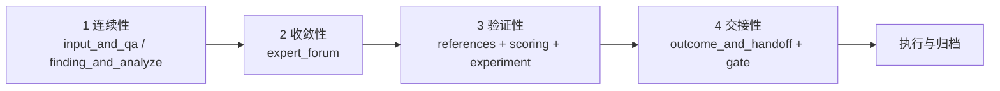
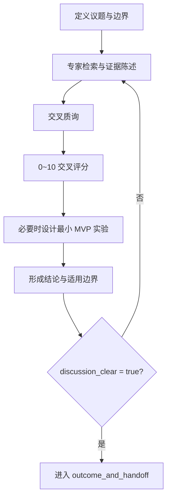
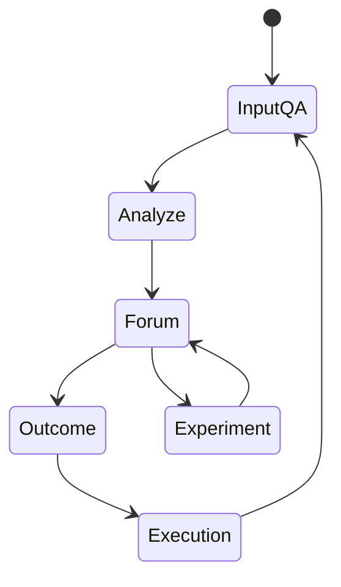

# Brainstorm 的自解释系统与专家论坛评审系统

> **Coding 的尽头是项目管理**

## 先说结论

如果把 Brainstorm 当作“临时想法记录”，系统会持续返工。要稳定产出，必须把它设计成决策基础设施。

本文的核心结论：

1. Brainstorm 的本质不是表达观点，而是持续做出可验证决策。
2. 论证顺序应固定为：先判断，再论证，最后给证据与动作。
3. 在执行层面，决策系统至少应覆盖四个独立维度：连续性、收敛性、验证性、交接性。

## 四个核心支柱（为什么它们缺一不可）

### 1. 连续性：为什么很多讨论总在“从头开始”

目标：保证跨会话可继承，避免“每轮重来”。

1. 固定输入与边界：`input_and_qa.md`
2. 固定分析与备选：`finding_and_analyze.md`
3. 固定争议收敛面：`expert_forum.md`
4. 固定交接输出：`outcome_and_handoff.md`

这四个文件不是模板偏好，而是组织级接口。文件名可自解释，协作才可继承。

### 2. 收敛性：为什么讨论越久，分歧反而越散

目标：把分歧放进同一机制，避免旁路决策。

1. 所有关键争议只在 `expert_forum.md` 收敛。
2. 论坛模式三选一：`deep_dive_forum`、`lightning_talk_forum`、`industry_readout_forum`。
3. deep-dive 与 lightning 模式必须有外部检索与证据映射。
4. 专家之间必须交叉评分（0~10），对象是论证质量而不是人。

### 3. 验证性：为什么“观点正确”不等于“路径可行”

目标：把“观点强弱”转成“证据强弱”。

1. 鼓励最小 MVP 实验，而非完整实现。
2. 实验统一落盘：`.bagakit/brainstorm/<discussion-id>/experimental/<expert>-<experiment>/...`
3. 实验可提供 1~5 附加分，无实验则附加分为 0。
4. 一旦存在实验目录，论坛必须写明实验结果与结论影响。

可执行评分形式：

`DecisionScore = 平均论证分 + 实验附加分 - 风险惩罚项`

### 4. 交接性：为什么“讨论结束”常常不等于“可以执行”

目标：把“讨论完成”变成“可执行完成”。

1. frontmatter 完整：参与者、关键问题、关键洞察、一句话结论。
2. `discussion_clear: true` 明确宣告收敛。
3. 角色平衡成立：深度思考、创造性探索、建设性质疑。
4. 模式约束达标：引用、评分、实验记录满足要求。

门禁通过后再进入 handoff；否则一律视为未完成。

## 架构图：四块如何协同

## 流程图：一次标准论坛如何结束

## 循环图：为什么它能长期运行

## 常见反模式（只保留 5 个高频项）

1. 命名漂移：阶段含义回到模糊语义。
2. 论坛旁路：关键决策在聊天里完成，未进入 SSOT。
3. 证据空转：有链接无映射，有评分无理由。
4. 结果前置：先写结论，再倒填证据。
5. 伪量化：分数存在，但与论证质量无关。

## 为什么要分三步落地（而不是一步到位）

1. 先跑通最小闭环：四文件 + 论坛门禁。
2. 再接入评分与实验附加分，形成可比较记录。
3. 最后基于失败样本迭代议程与权重。

先可运行，再可评估，再可演进。不要从“终局模板”开始。

## 结语

当任务简单时，编码能力决定上限。  
当任务跨时间、跨角色、跨上下文时，系统设计决定上限。

代码解决局部正确性；项目管理解决持续正确性。  
这不是立场，而是复杂工程的运行事实。

**Coding 的尽头是项目管理。**
