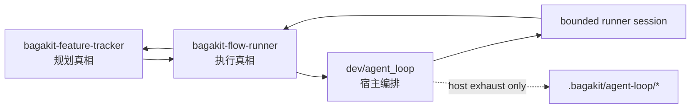

# Bagakit Agent Loop 三件套：规划、执行、宿主为什么必须拆开

真正把 Agent loop 做复杂以后，最先坏掉的通常是权责边界。命令数量增加本身通常还能忍，一个脚本同时管理 feature 生命周期、执行状态、runner 会话、通知、恢复和观察，才会把“当前到底什么算真相”搅成一团。Bagakit 的三件套，就是在这种混乱边缘被硬拆出来的：`bagakit-feature-tracker` 管规划真相，`bagakit-flow-runner` 管执行真相，`dev/agent_loop` 管宿主侧 loop。

这个题值得单独成文，因为这三个目录背后有一条可迁移的方法线。只要你准备在 Bagakit 里继续做另一个类似的复杂系统，这条线迟早还会再用一次。问题很具体：一个 loop 到底该按什么边界拆，系统才不会在第二轮演化时重新长回一个大脚本。

## 三件套先要分开三种真相

真正需要先分开的，是三类会在长期演化里互相污染的真相。第一类是真正的工作规划：什么 feature 还活着，当前 task 是谁，workspace 在哪，gate 过没过，什么时候 archive。第二类是真正的执行状态：当前 item 到了哪一 stage，上一轮 session 写没写 checkpoint，有没有 incident，下一步该继续跑、清 blocker 还是 closeout。第三类才是宿主侧机械状态：runner argv、run lock、stdout/stderr、watch 面板、告警投递和一轮 host run 的停机原因。

一旦把这三类真相放进同一个 surface，系统就会开始偷懒。规划层会顺手写执行缓存，执行层会顺手改生命周期，宿主层会顺手把临时观察产物当成控制面输入。表面上是“少几层”，实质上是“以后谁都能越权”。Bagakit 这次选择反过来做：先承认这三类信息不该混在一起，再让工具围绕这个边界各自最小化。

下面这张图说明的是这套边界的最短闭环。图里最重要的是反向写回被禁止。

这也是为什么三件套看起来比“一个命令跑到底”麻烦，但系统行为反而更可控。`feature-tracker` 可以决定一个 feature 是否还活着，`flow-runner` 可以决定某个 item 当前是否还能继续执行，`agent_loop` 只能决定这次要不要再开一个 bounded session。每层都能停，但不能替别层宣判。

## 三件套各自解决的是不同故障

`bagakit-feature-tracker` 解决的是“规划会不会漂”。它把 feature identity、task progression、workspace assignment、gate、archive/discard 全都收进 `.bagakit/feature-tracker/`，因此 task 的完成态、feature 的关闭态、worktree 的归属不会被 session 级日志稀释。你后面再加一个更复杂的执行器，也不需要重写 planning truth，只需要继续消费这个层的稳定输出。

`bagakit-flow-runner` 解决的是“执行会不会失真”。它不碰 feature 生命周期，只维护 `.bagakit/flow-runner/` 下面的 item state、checkpoint、incident、resume-candidates 和 `next-action.json`。这一步看似保守，实际先把最容易漂移的部分稳定住了：host 不再需要猜“runner stdout 到底算不算完成”，也不需要靠本地缓存记住“下一轮该继续什么”。只要 `next-action` 和 checkpoint 还在，执行面就能被宿主重复读取。

`dev/agent_loop` 解决的是“宿主会不会重新发明状态机”。它只拿 flow-runner 的 item 当输入，再围绕 runner config、run lock、session exhaust、typed stop payload 和 watch 做 host orchestration。这样做的收益很直接：就算 host 自己挂了一次，`.bagakit/agent-loop/` 里最多只留下宿主 exhaust，不会反过来污染执行真相，更不会越权改 feature 生命周期。

| 层 | 主要职责 | 不能碰的东西 | 典型产物 |
| --- | --- | --- | --- |
| `bagakit-feature-tracker` | feature/task 规划真相 | repeated execution orchestration | `.bagakit/feature-tracker/features/*` |
| `bagakit-flow-runner` | item 执行真相 | feature lifecycle、task gate、task commit | `.bagakit/flow-runner/items/*` |
| `dev/agent_loop` | host loop 与 runner 会话编排 | item state、checkpoint semantics、tracker closeout authority | `.bagakit/agent-loop/*` |

这个表真正想防的是一种常见误判：看到三个目录就误读成它们在重复记录同一件事。实际记录的是三个不同层级的完成条件。重复的只是名字，authority 并没有重叠。

## 这套拆法的目标是止损

真正值得强调的是，三件套直接来自运行中的失败，顺序正好相反。系统一旦进入“多轮 bounded session + 可恢复执行 + 上游规划还在变化”的状态，一个单层 loop 最容易暴露三种损耗。

第一种损耗是 closeout authority 漂移。执行器一旦既能跑 session 又能判断任务做完，很快就会顺手把 feature 也关掉。这样短期省一步手工操作，长期却会让规划层失去主权。Bagakit 的处理方式很硬：tracker-sourced item 的 closeout 只能上游确认，`flow-runner` 和 `agent_loop` 都不能擅自 archive。

第二种损耗是 host exhaust 反向污染控制流。很多系统做到后面，watch 面板、会话 transcript、上一轮 stderr 或“临时诊断文件”会悄悄变成下轮调度依据。这样调起来很顺，回放时却几乎不可审计。Bagakit 这里故意把 `.bagakit/agent-loop/` 定义成 host exhaust，只能看，不能回写成 execution truth。

第三种损耗是 runner stdout 被误当成完成信号。只要系统默认“CLI 打印看起来成功”，后面就很难再补 checkpoint discipline。Bagakit 反过来要求 host 只信 `flow-runner` 的 `next-action`、`resume-candidates` 和 checkpoint receipt。stdout 顶多当诊断材料，不当控制面事实。

这三种损耗有一个共同点：它们在 demo 阶段都不明显，甚至看起来像是“少一层抽象”的优化。但进入第二个系统、第三种 runner、第四轮 refactor 后，它们会一起把 authority 搅乱。所以这套拆法本质上是一种返工控制手段，作用就是先把最贵的返工源头切掉。

## 写成“一套 loop”会误导，写成“authority split”才有迁移价值

如果成文时只写成“Bagakit 有三个工具：一个管 feature，一个管 flow，一个管 loop”，信息量其实不够。后来者会以为这只是目录拆分，甚至觉得自己完全可以在另一个系统里把三者再揉回去，只保留几个 JSON 文件名。真正可迁移的部分是 authority split。

一个常见坏写法是这样：

> `agent_loop` 负责不停跑 task，`feature-tracker` 负责记录 feature，`flow-runner` 负责执行。

这句话的问题不在简略，而在错位。它把三层说成了三个动作，却没说清“谁有权宣布什么为真”。读完以后，你还是不知道哪一层可以关 item，哪一层可以关 feature，哪一层只能观察不能改。

更好的写法应该像这样：

> `bagakit-feature-tracker` 决定什么工作还活着，`bagakit-flow-runner` 决定这个工作现在处于什么执行状态，`dev/agent_loop` 只负责把一次 runner session 包起来，并在每轮后重新读取执行真相。

这段改写真正补上了裁决权层。后来你把这套方法迁移到另一个复杂系统时，具体目录、schema、命令名都可能变，但“谁宣布活跃态”“谁宣布执行态”“谁只能消费不能宣判”这三件事不能变。文章只有写到这个粒度，才配叫方法文，README 改写远远不够。

## 另一个复杂系统应该继承什么

如果你接下来准备用 Bagakit 三件套去落另一个复杂系统，真正该复制的是三条边界，不必复制 `.bagakit/agent-loop/` 这些路径名。第一，规划面必须有自己独立的 SSOT，不能让执行层代替它宣布 feature closeout。第二，执行面必须有自己独立的 checkpoint 和 next-action，不能让宿主靠日志和 stdout 猜状态。第三，宿主面必须明确自己只是 host plane，不能把观察产物反向写成调度真相。

反例也很明确。你完全可以做一个“全栈 loop 工具”，第一次试跑甚至会感觉更顺：一个命令创建任务、跑执行、发通知、自动 closeout，日志还全在一个目录里。问题是第二个系统接进来时，它就会立刻暴露出不可迁移的部分：规划策略和执行策略绑死，host 恢复逻辑依赖私有日志，closeout authority 只能靠读代码猜。看起来省掉了三件套，实际上是把后面所有复杂度预支成一个大脚本。

所以这件事应该写，而且应该写成一篇“为什么拆、拆在哪里、以后怎么迁移”的文章。命令手册可以单独写。最小可执行的下一步也很清楚：先把正文放进 `blogs/`，把核心图、边界表和反例写全。等后续真的用三件套去承接另一个复杂系统时，再补第二篇实践文，专门写迁移中的失败模式和收口条件。验收指标不复杂，只看三件事：后来者能不能在 5 分钟内说清三层 authority，能不能不靠源码猜 closeout ownership，能不能把这套边界复用到一个新系统而不重新长出单层 loop。
