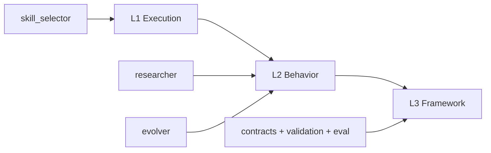

# System Architecture

## System Boundary

Bagakit is a repository-level system.

The repository is jointly maintained as one system whose runtime-facing skills
are independently distributable, but not independently governed. That
distinction matters because Bagakit has to solve two different kinds of
evolution at once:

- repository-level capability evolution
- host-level adoption evolution

The rest of this document explains how the system keeps evidence, decision,
promotion, and durable truth distinct instead of flattening them into one
general-purpose workflow engine.

Governance structure, self-hosting, and the system-owned distributable runtime
boundary are defined in:

- `docs/architecture/A2-governance-structure.md`

## Actors And Authority

The architecture only makes sense if the main participating actors and their
authority are separated early.

### Maintainer

Maintainers govern the repository system.

Their authority includes:

- deciding what belongs in Bagakit
- deciding what remains host-specific
- approving promotion into durable surfaces
- maintaining framework truth

### Host Repository

A host repository is where Bagakit is applied.

It produces real adoption evidence, friction, and host-specific operating
knowledge. It does not automatically define upstream Bagakit truth.

### Runtime Agent

The runtime agent consumes skills and runtime surfaces during concrete work.

It can produce evidence, but it does not have independent promotion authority.

The functional systems that produce evidence and govern repository learning are
defined later as functional systems, not as authority actors.

## Core Problems

The architecture needs to solve a small set of real problems. The rest of the
design should be read as a consequence of these problems, not as a list of
parts.

### Problem 1: Distributed Evidence Must Be Allowed

Evidence is produced across many surfaces:

- research workspaces
- task execution
- host reviews
- benchmarks
- validation failures
- practice artifacts

Bagakit cannot improve if these signals are discarded, but it also cannot stay
coherent if all of them are treated as durable truth.

### Problem 2: Learning Happens At Different Scopes

One task may teach something useful without justifying a repository-level
change.

One host may discover an adoption rule that should not be promoted upstream.
At the same time, some repeated lessons clearly should become shared upstream
capability or governance.

### Problem 3: Evidence Is Produced Everywhere, But Promotion Authority Must Stay Centralized

The system that gathers evidence should not also be the system that silently
turns that evidence into durable truth.

If those roles collapse, research habits, host habits, and temporary local
judgments become architecture by accident.

### Problem 4: Host And Upstream Evolution Must Be Routable

Bagakit needs one explicit answer when new learning appears:

- does it stay in the host
- does it move upstream
- does it split

Without that routing step, host adoption and upstream capability evolution will
keep contaminating each other.

### Problem 5: Distribution And Shared Evolution Must Coexist

Bagakit deliberately separates:

- distributable runtime skills
- maintainer-only governance and contracts

That means the architecture must support:

- distribution of runtime capability
- shared maintenance of one system

without leaking maintainer-only truth into payloads.

### Problem 6: Framework Surfaces Can Become Shadow Truth

Contracts, validators, evals, registries, and helper tooling all exist to
protect the system. They become dangerous when they quietly redefine the
system.

The architecture therefore has to keep framework truth explicit and bounded.

## Layer Model

The repository is designed through three main levels.

### L1: Execution

L1 owns concrete task or run execution.

It is where local work happens, where task-specific choices get made, and where
task-specific evidence is first created.

Typical concerns:

- task preparation
- task-local gates
- live execution state
- checkpoints
- handoff
- task-level skill selection and usage evidence

### L2: Behavior

L2 owns repeated, higher-order behavior around execution.

It decides how Bagakit learns from work, how evidence is shaped into decision
memory, and how promotion is routed.

Typical concerns:

- evidence production
- evidence intake
- structured learning behavior
- repository learning memory
- promotion routing
- outer-driver behavior

### L3: Framework

L3 owns stable framework semantics and quality protection.

It should be the slowest-moving layer.

Typical concerns:

- shared contracts
- validation registration
- eval and benchmark boundaries
- directory-protocol skill discovery semantics
- framework vocabulary

The three levels should not be flattened into one implementation surface.

They answer different questions:

- L1 answers: what is happening now
- L2 answers: how the system learns and routes
- L3 answers: what must stay stable and how it is protected

Detailed layer design lives in:

- `docs/architecture/A3-core-harness-topology.md`
- `docs/architecture/B1-execution-architecture.md`
- `docs/architecture/B2-behavior-architecture.md`
- `docs/architecture/B3-framework-architecture.md`

## First Principles

The problems above lead to a small set of first principles.

The governing chain is:

- evidence
- decision memory
- promotion
- durable surface

`evidence` includes both:

- research
- practice

### 1. Evidence Is Not Durable Truth

Evidence may be rich, noisy, contradictory, and distributed.

It is valuable because it informs later decisions, not because it is already
fit to become durable architecture or runtime behavior.

### 2. Distributed Evidence, Bounded Truth

Bagakit should allow evidence to remain distributed while keeping durable truth
tightly bounded.

The system should prefer explicit compression and routing over forced
centralization.

### 3. Promotion Is A Governed Step

Nothing should become durable Bagakit truth merely because it was observed,
researched, logged, or benchmarked.

Durable change happens only through explicit promotion.

### 4. Task-Level Learning And Repo-Level Learning Must Stay Separate

Task evidence should stay task-shaped until it proves repository value.

Repository-level learning should only absorb evidence that deserves repository
attention.

### 5. Runtime Distribution And Maintainer Governance Must Stay Separate

Runtime payloads should stay installable and distributable.

Maintainer-only rules, procedures, review gates, and architecture decisions
must stay outside runtime payloads unless a specific runtime capability really
depends on them.

### 6. Naming Must Reduce Confusion

Names should reveal ownership and scope, not hide them.

If two concepts live at different scopes or layers, their names should make
that difference easier to see.

## Functional Model

The architecture responds to the problems and principles by separating a small
set of functional systems.

Concrete harness topology and composition rules live in:

- `docs/architecture/A3-core-harness-topology.md`

The detailed flow design that connects these systems lives in:

- `docs/architecture/C1-evidence-and-promotion-flow.md`
- `docs/architecture/C2-routing-model.md`

### `researcher`

`researcher` is the independent evidence-production system.

It owns:

- source finding
- original preservation
- summary creation
- topic-level research workspaces

It exists because Bagakit needs high-quality evidence production without
collapsing evidence production into promotion authority.

When this role is carried by a system-owned runtime unit, that runtime unit
should still live under:

- `skills/harness/`

while remaining independently distributable.

### `living_knowledge`

`living_knowledge` is the host or project knowledge substrate.

It owns:

- the shared checked-in knowledge surface
- managed project instructions
- the shared path protocol for related host-facing systems
- project-level normalization, indexing, recall, and reviewed-ingestion behavior

It exists because host knowledge should have a real home without being
misidentified as repository-system evolution memory.

When this role is carried by a system-owned runtime unit, that runtime unit
should still live under:

- `skills/harness/`

while remaining independently distributable.

### `skill_selector`

`skill_selector` is the task-level or host-level evidence loop.

It owns:

- selecting skills or references for one task
- recording what was actually used
- recording what helped or failed
- preserving task-level practice evidence

It exists because task-level learning should not be forced directly into the
repository-level learning system.

### `evolver`

`evolver` is the repository-level learning system.

It is not the whole learning universe. It is the control plane that turns
distributed evidence into repository-level decisions and promotions.

It does two different jobs:

- memory work
  - intake, linking, indexing, retrieval, compaction, and archive behavior
- decision work
  - candidate comparison, decision memory, promotion routing, and promotion
    state

These two jobs are kept inside one system because Bagakit should not split
repository learning into an empty memory platform on one side and an empty
decision surface on the other.

`evolver` is not a superset of `living_knowledge`.

The relationship is:

- `living_knowledge` may provide evidence
- `evolver` decides what matters at repository-system scope
- only routed and reviewed learning can later move into durable surfaces

### `outer_driver`

`outer_driver` owns repeated-run behavior around execution.

It exists because repeated rounds, next-item selection, and host-side
orchestration are behavior concerns, not just one-off execution concerns.

### framework surfaces

Framework surfaces own:

- contracts
- validation
- eval
- directory-protocol skill discovery semantics
- architecture rules

They exist to protect the system, not to replace its behavioral or execution
layers.

## Core Flows

Detailed flow design lives in:

- `docs/architecture/C1-evidence-and-promotion-flow.md`
- `docs/architecture/C2-routing-model.md`

### Evidence Intake Flow

Bagakit assumes that evidence is distributed.

The architecture does not force raw evidence into one canonical store.
Instead, distributed evidence passes through explicit intake before it becomes
repository decision memory.

The detailed intake model, including hidden workspaces and `.mem_inbox`, is
defined in:

- `docs/architecture/C1-evidence-and-promotion-flow.md`
- `docs/architecture/C2-routing-model.md`

### Decision-Memory Flow

Decision memory begins when repository learning stops merely collecting
material and starts structuring what that material means.

At Bagakit system scope:

- `evolver.memory_plane` keeps evidence structured
- `evolver.decision_plane` compares candidates and records decisions

### Routing Flow

Before anything becomes durable truth, the system routes the learning through:

- `host`
- `upstream`
- `split`

That routing belongs to `evolver.decision_plane`.
The detailed routing semantics are defined in:

- `docs/architecture/C2-routing-model.md`

### Promotion Flow

Promotion only happens after decision memory, routing, and the relevant review
or quality gate.

Promotion is the explicit bridge from reviewed decision memory into a durable
surface. It is not evidence collection, raw storage, or routing by itself.

### Durable Surface Flow

Durable truth lands in only a few places:

- `docs/specs/`
  - stable shared semantics and contracts
- `docs/stewardship/`
  - maintainer-facing governance and operating guidance
- `skills/`
  - runtime-facing distributable capabilities

This means:

- evidence is not durable truth
- decision memory is not yet durable truth
- promotion is the bridge, not the destination

Only routed and reviewed promotion should enter these surfaces.

## Architecture Consequences

### Level Mapping

The functional systems map into the three levels like this:

In practical terms:

- L1 owns what is happening now
- L2 owns how the system learns and routes
- L3 owns what must stay stable and how it is protected

### Concrete Harness Topology

The detailed core harness topology, explicit composition rule, and current
runtime mapping live in:

- `docs/architecture/A3-core-harness-topology.md`

### What This Architecture Rejects

This architecture explicitly rejects a few tempting but wrong directions.

1. one giant learning bucket
   - Bagakit should not merge research, runtime state, evidence, and durable
     truth into one memory surface
2. making `evolver` the whole learning system
   - `evolver` should not absorb the full research workflow, every task lesson,
     or every host-specific local practice
3. letting naming blur the layers
   - `bagakit-skill-selector` is better than `bagakit-skill-usage-loop`
   - `bagakit-skill-evolver` stays reserved for repository-level learning
4. treating evaluation as optional polish
   - `evolver` is not complete until it has both validation and eval

Implementation status, completion criteria, and next-step work should be kept
in stewardship surfaces rather than mixed into this architecture document.
