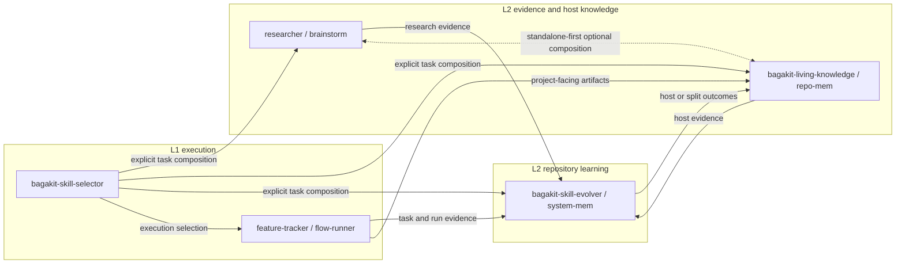

# Core Harness Topology

## Purpose

This document defines how the core system-owned harness skills cooperate
without collapsing into one monolith.

It focuses on three things:

- the concrete runtime topology under `skills/harness/`
- the paired knowledge and memory surfaces those runtime units work with
- the composition rule that allows deep coupling without breaking independent
  distribution

This document sits below:

- `docs/architecture/A1-system-architecture.md`
- `docs/architecture/A2-governance-structure.md`

It is the place where the core harness design stops being abstract and starts
showing how the main runtime units fit together.

## Governing Claim

The core harness is not a bag of unrelated skills.

It is one cooperating topology with three properties that must hold at the
same time:

- the runtime units can be deeply coupled when used together
- the runtime units must remain independently distributable and independently
  usable
- the composition must stay explicit instead of becoming hidden mutual
  hard-dependency

The system achieves that by making:

- `bagakit-skill-selector`
  - the explicit composition entrypoint

rather than letting runtime units silently absorb each other.

## Topology Diagram

## How To Read The Diagram

The diagram uses paired labels when a runtime unit and its primary working
surface should be read together.

The pairs mean:

- `bagakit-skill-evolver / system-mem`
  - the runtime unit plus its primary repository-system memory surface under
    `.bagakit/evolver/`
- `bagakit-living-knowledge / repo-mem`
  - the runtime unit plus its host or project knowledge surfaces such as
    `AGENTS.md`, `knowledge/`, and `.bagakit/living-knowledge/`
- `researcher / brainstorm`
  - the stable evidence-production role plus its most recognizable current
    evidence-production capability family
- `feature-tracker / flow-runner`
  - the current execution-surface naming direction for planning truth and
    repeated execution flow

In this document:

- `repo-mem` is shorthand for repository-local host or project knowledge
  surfaces
- it does not mean repository-system evolution memory

That distinction remains fixed:

- host or project knowledge belongs to `living_knowledge`
- repository-system evolution memory belongs to `evolver`

## The Four Core Runtime Roles

### `researcher / brainstorm`

This side produces higher-quality evidence.

Its job is:

- source finding
- original preservation
- summary packaging
- topic-level research capture

It should stay independent because evidence production and promotion authority
must not collapse.

### `feature-tracker / flow-runner`

This side stays close to work.

Its job is:

- feature or ticket planning truth
- execution-state truth
- repeated execution flow
- task- and run-level evidence emission

It should stay separate because execution truth is not repository learning
truth.

### `bagakit-skill-evolver / system-mem`

This side is the repository-system learning control plane.

Its job is:

- intake
- structured decision memory
- routing
- promotion preparation
- repository-level learning state

It should stay separate because repository-system learning must not become a
bag of host notes or task logs.

### `bagakit-living-knowledge / repo-mem`

This side is the host or project knowledge substrate.

Its job is:

- project docs
- managed project instructions
- shared recall surfaces
- local and shared knowledge upkeep
- host-facing memory structure

It should stay separate because host or project knowledge is not the same thing
as repository-system evolution memory.

## Deep Coupling Without Hidden Dependency

The most important coupling rule in this topology is the seam between:

- `researcher`
- `living_knowledge`

They are deeply coupled in practice.

`researcher` wants:

- the storage conventions
- the directory layout
- the recall surfaces
- the knowledge-root discipline

that `living_knowledge` already provides.

At the same time, `living_knowledge` benefits from `researcher` because
researcher can provide:

- better source capture
- better summaries
- better evidence packaging
- better research-shaped intake into host knowledge

So the design should not pretend these two sides are unrelated.

But their coupling still needs one hard constraint:

- deep coupling is allowed only as explicit composition
- standalone use must still work when the other side is absent

That means each side should keep a simplified standalone mode:

- `researcher`
  - can still capture and package research with local logic when
    `living_knowledge` is absent
- `living_knowledge`
  - can still run capture, recall, and knowledge upkeep when `researcher` is
    absent

This is how Bagakit keeps:

- deep cooperation
- independent distribution

at the same time.

## Why `bagakit-skill-selector` Owns Composition

The composition should not be hidden inside:

- `researcher`
- `living_knowledge`
- `evolver`

It should be owned by:

- `bagakit-skill-selector`

That is the critical design rule.

`bagakit-skill-selector` exists at the task or host adoption layer, which is
exactly where the composition decision belongs.

Its job is not only:

- choosing one skill
- recording one usage event

It is also the place where Bagakit can explicitly say:

- use `living_knowledge` alone
- use `researcher` alone
- use both together
- route resulting evidence toward `host`, `upstream`, or `split` later

That buys three things at once:

1. the composition stays visible
2. the composition stays reviewable and reversible
3. the participating runtime units do not need hidden hard-dependencies on one
   another

So selector-mediated composition is not an implementation convenience.
It is the boundary mechanism that makes deep coupling compatible with
independent distribution.

That does not mean selector owns the behavior systems it composes.

Selector may:

- choose
- compose
- invoke
- log

for one task or host case.

Selector does not own:

- `researcher` semantics
- `living_knowledge` semantics
- `evolver` semantics
- their state surfaces
- their promotion authority

## Self-Hosting Consequence

When Bagakit runs inside its own canonical repository, this topology can be
used on itself.

That means one self-hosting task may explicitly compose:

- `researcher`
- `living_knowledge`
- `bagakit-skill-selector`
- `bagakit-skill-evolver`

inside the same physical repository.

Even then, the boundaries still hold:

- `living_knowledge`
  - host or project knowledge substrate
- `evolver`
  - repository-system learning control plane

So self-hosting does not remove the need for:

- explicit composition
- explicit routing
- bounded promotion

It only means the canonical repository can act as both:

- the host being observed
- the system being improved

## Current Mapping And Naming Direction

Current canonical runtime units in this topology are:

- `skills/harness/bagakit-skill-selector/`
- `skills/harness/bagakit-skill-evolver/`
- `skills/harness/bagakit-living-knowledge/`

Current canonical project-state surface:

- `.bagakit/evolver/`

Current execution-surface naming direction is:

- `bagakit-feature-tracker`
  - feature or ticket planning truth and lifecycle state
- `bagakit-flow-runner`
  - adjustable repeated execution flow over normalized work items

Current maintainer-side outer-driver tool:

- `dev/agent_loop/`
  - host orchestration around bounded flow-runner sessions

The `researcher` role is architecture-stable even if its final canonical
harness runtime unit is still evolving.

For now, `brainstorm` is the most visible current evidence-production family
that makes the role concrete.

## Non-Goals

This topology does not imply:

- that tightly coupled skills should be merged into one giant runtime unit
- that standalone distribution is only a temporary compatibility trick
- that selector should become a hidden workflow brain for repository-level
  promotion
- that `living_knowledge` and `evolver` may collapse into one memory bucket
