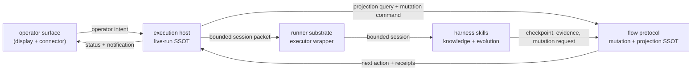

# Runtime Control Chain

## Purpose

This document defines the cross-surface runtime control chain for Bagakit.

It exists to keep these responsibilities separate:

- presenting state to an operator
- deciding what one live run should do next
- validating and persisting execution-state changes
- launching one bounded executor session
- letting harness skills feed knowledge and evolution results back into
  execution

Field-level contracts stay in the owning specs. This document owns the
architecture flow between those surfaces.

## Governing Claim

One autonomous run has two different source-of-truth questions:

- the execution host owns live-run decisions
- the flow protocol owns accepted execution-state mutations and projections

The execution host answers questions such as:

- what focus is currently being driven
- whether the same run should continue
- whether one recovery session is allowed
- whether operator attention is required

The flow protocol answers questions such as:

- what state transitions are valid
- which checkpoint, progress, incident, and plan-revision records are accepted
- what the current next-action projection says
- which receipts prove that execution-facing state changed

Those truths are adjacent, but they are not interchangeable.

## Control Chain Diagram

In this diagram, SSOT means the only surface whose answer may be treated as
canonical for that specific question.

## Layer Responsibilities

### Operator Surface

The operator surface includes displays, watch views, notifications, and
connectors.

It may:

- present host status and protocol projections
- deliver operator intent to the execution host
- carry notifications or attention requests

It must not:

- select or mutate the current execution focus by itself
- write protocol-owned state directly
- treat connector delivery success as execution success

### Execution Host

The execution host owns live-run control.

It may:

- hold the repo-local run lock
- choose one runnable focus from protocol projections
- decide whether to continue, recover, wait, or stop
- create the bounded session context handed to the runner substrate
- emit host stop and notification payloads

It must not:

- redefine checkpoint or incident semantics
- treat runner stdout as execution-state truth
- bypass the protocol when accepting state changes
- turn connector state into execution state

### Flow Protocol

The flow protocol owns execution-facing mutation and projection truth.

It may:

- validate state transitions
- persist checkpoints, progress, incidents, plan revisions, and handoff state
- emit mutation receipts
- compute next-action and resume projections

It must not:

- launch executor processes
- decide operator attention policy
- own display or connector delivery
- absorb host-side session exhaust

This is the layer where the current skill-local protocol kernel belongs. If
the runtime grows beyond one skill-local implementation, the same narrow kernel
boundary may be extracted without moving host or display responsibilities into
the protocol layer.

### Runner Substrate

The runner substrate owns one bounded executor session.

It may:

- expand argv and environment templates
- launch one configured runner
- capture prompt, stdout, stderr, and neutral session facts
- report process-level stop facts to the execution host

It must not:

- decide whether the flow advanced
- write checkpoint or incident truth
- decide whether the operator should be interrupted
- become a hidden skill-composition engine

### Harness Skills

Harness skills own their own domain behavior.

Examples include:

- repository evolution
- host or project knowledge
- research and evidence production
- task-local skill selection

When a skill produces execution-facing effects, those effects should return
through the flow protocol as typed mutations, receipts, or evidence references.
Raw stdout, chat text, or connector messages are not accepted state changes.

## Current Bagakit Mapping

Current surfaces are not yet a perfect one-directory-per-layer split.
The architecture target is still useful because it names which responsibility
each surface may own.

| Runtime role | Current Bagakit surface |
| --- | --- |
| operator surface | `dev/agent_loop` watch, status, run payloads, and notification delivery |
| execution host | `dev/agent_loop` run loop, lock, continuation classification, recovery budget, and host stop policy |
| flow protocol | `skills/harness/bagakit-flow-runner` state, checkpoints, progress, incidents, mutation receipts, next-action, and resume projections |
| runner substrate | `dev/agent_runner` and the runner-launch portion consumed by `dev/agent_loop` |
| harness skills | `skills/harness/bagakit-living-knowledge`, `skills/harness/bagakit-skill-evolver`, `skills/harness/bagakit-researcher`, `skills/harness/bagakit-skill-selector`, and peers |

The important design direction is:

- `dev/agent_loop` may be a host implementation
- `dev/agent_runner` may be a reusable executor wrapper
- `bagakit-flow-runner` owns the current protocol surface and keeps its
  skill-local kernel under `scripts/lib/protocol/`
- harness skills should feed execution-facing changes back through the flow
  protocol instead of inventing parallel state files

## Adoption Rules

### Presentation Must Route Through The Host

Displays and connectors may expose current state, but commands that affect a
live run should route through the execution host.

This keeps notification delivery, UI refresh, and connector availability from
becoming accidental execution truth.

### Host Must Route State Changes Through The Protocol

The host may decide what to attempt next, but accepted state changes belong to
the flow protocol.

Host-owned session exhaust can explain what happened. It cannot replace
checkpoint, progress, incident, or next-action truth.

### Runner Must Stay A Wrapper

The runner substrate should stay small enough to be reused by host loops,
evals, or other tools.

It should not absorb:

- work selection
- continuation policy
- checkpoint semantics
- skill-composition policy

### Skills Must Return Through The Protocol

Harness skills may update their own runtime surfaces. When they need to affect
execution state, they should emit protocol-shaped output that the flow protocol
can validate and receipt.

This is the feedback edge that makes the loop:

- host drives
- protocol frames
- runner executes
- skills learn or produce evidence
- protocol accepts the execution-facing result

### Kernel Extraction Should Be Narrow

The current skill-local protocol kernel, and any future extracted protocol
kernel, should own only:

- domain state types
- mutation services
- read services
- receipts
- projections
- persistence safety
- contract and boundary tests

It should not own:

- operator displays
- connector delivery
- host stop policy
- runner process launch
- skill domain behavior
- compatibility wrappers for retired command shapes

The extraction boundary is behavioral, not only directory-shaped. A protocol
kernel may be called by `bagakit-flow-runner` or another host-facing adapter,
but the accepted mutation result must still be a protocol receipt and the
current projection must still be read through the protocol surface.

Kernel callers should pass typed mutation requests. They should not pass raw
runner stdout, connector payloads, or display-layer observations as accepted
execution truth.

Minimum kernel mutation expectation:

Field-level mutation and receipt contracts belong to
`docs/specs/flow-runner-contract.md`. At the architecture layer, a protocol
kernel should still preserve these responsibilities:

- mutation kind
- target item identity
- expected current state or stage where applicable
- operator or session evidence reference
- protocol-owned timestamp or sequence assignment
- accepted receipt payload
- refreshed projection payload when the mutation changes runnable state

Minimum receipt expectation:

The owning flow-runner spec defines the current receipt schema and fields. This
architecture requires only the boundary meaning:

- a receipt proves one accepted protocol mutation
- a receipt must identify the target item and mutation outcome
- a receipt must be persisted before the host treats the mutation as durable
- a receipt must not be synthesized from host exhaust after the fact
- host, runner, and skill logs may reference receipts, but they do not replace
  receipts

## Validation Consequences

Boundary validation should prove the chain from both sides:

- operator surfaces do not write protocol-owned state directly
- the execution host consumes protocol projections before launching sessions
- runner substrate tests do not need protocol or skill internals
- protocol tests do not import display, connector, or process-launch code
- skill feedback into execution uses protocol-shaped mutations or receipts
- mutation receipts are structured protocol payloads, not prose-only claims
- host exhaust and connector delivery receipts remain outside protocol truth
- kernel extraction, when present, does not absorb host stop policy or runner
  process launch

Those checks belong in repository validation surfaces, not inside runtime skill
payloads alone.

Validation plan:

No single backbone anchor check proves the whole chain. The expected coverage is
the combination of this backbone contract check plus the owner-local default
suites for flow-runner and agent-loop.

- backbone contract check:
  - verify this document names the five runtime roles and the allowed kernel
    ownership set
  - verify the forbidden kernel ownership set includes display, connector,
    host-stop, runner-launch, and skill-domain behavior
  - verify the receipt rule says receipts are protocol-owned accepted mutation
    proof
- flow protocol owner check:
  - owner-local flow-runner suites run smoke coverage for activation, checkpoint, progress,
    invalid-stage rejection, tracker-sourced override rejection, closeout
    boundary, and validation
  - assert checkpoint JSON uses `bagakit/flow-runner/checkpoint/v2`
  - assert progress NDJSON uses `bagakit/flow-runner/progress/v1`
  - assert checkpoint and progress receipt session numbers match item runtime
    state after mutation
- execution host owner check:
  - owner-local agent-loop suites run smoke coverage for host selection, bounded session launch,
    runner-result reconciliation, session observation, operator-required stops,
    notification delivery, and watch rendering
  - assert host exhaust never becomes checkpoint truth
  - assert notification delivery receipts remain under `.bagakit/agent-loop/`
    and do not appear under `.bagakit/flow-runner/`
- import-boundary check, once a kernel directory exists:
  - protocol kernel modules must not import `dev/agent_loop`, display,
    notification delivery, or runner-launch modules
  - `dev/agent_loop` may call protocol adapters, but must not import internal
    mutation persistence helpers except through a declared adapter surface
  - runner substrate tests should not import flow-runner or harness-skill
    internals

## Related Contracts

- `docs/specs/agent-loop-contract.md`
- `docs/specs/agent-runner-contract.md`
- `docs/specs/flow-runner-contract.md`
- `docs/specs/runtime-surface-contract.md`
- `docs/architecture/C3-outer-driver-stop-and-recovery-model.md`
