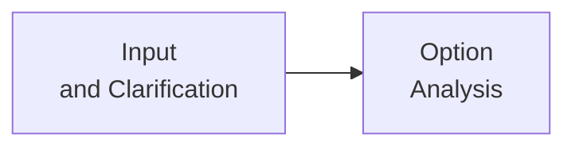
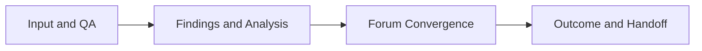
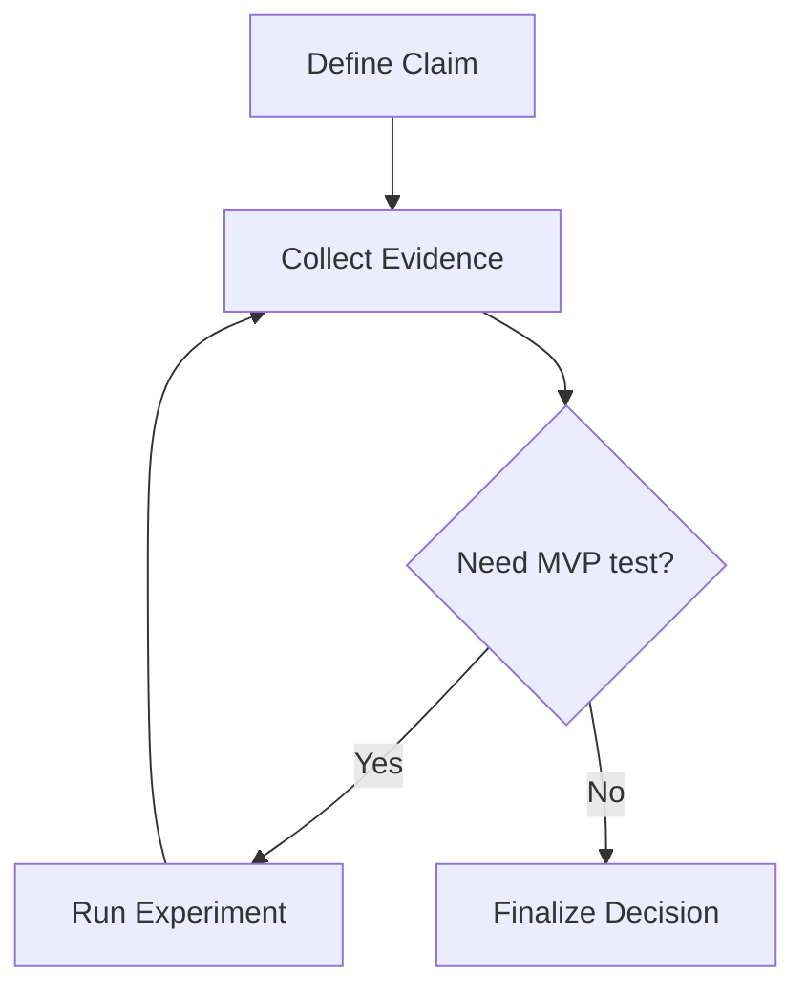
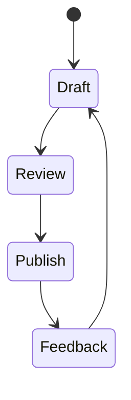

# Markdown and Diagram Formatting Handbook

This document captures practical formatting rules for GitHub-flavored Markdown and
Mermaid diagrams. The goal is stable rendering, fast review, and low ambiguity.

## 1. Scope and Priority

Use this priority order when formatting decisions conflict:

1. render stability across common GitHub views
2. scan speed for reviewers
3. visual polish

If a formatting choice reduces rendering reliability, do not use it.

## 2. Line Break Rules (Markdown)

Markdown line breaks differ by context.

- In issue/PR comments, many line breaks are auto-rendered.
- In `.md` files, plain newlines are often soft wraps.

For explicit hard breaks in `.md` files, use one of:

- two trailing spaces
- trailing backslash `\`
- HTML `<br/>`

Prefer `<br/>` when readability must be explicit in source.

## 3. Table Stability Rules

- Keep a blank line before tables.
- Keep one table for one verification purpose.
- Do not mix narrative paragraphs inside table cells unless necessary.
- Align columns to checks: `field`, `rule`, `evidence`, `failure handling`.

Good table use:

| Field | Rule | Failure handling |
|---|---|---|
| `discussion_clear` | must be `true` before handoff | return to forum |
| `user_review_status` | must be explicit | keep open |

## 4. Code Block Rules

- Always use fenced code blocks.
- Always add language hints (`bash`, `json`, `yaml`, `mermaid`, etc.).
- Keep examples minimal and runnable.
- For shell examples, prefer copy-paste-safe blocks with no prompt symbol.

## 5. Use `<details>` for Secondary Content

When a section has high-value but non-primary detail, collapse it.

Typical use cases:

- long logs
- expanded evidence tables
- implementation appendix fragments

Pattern:

```html
<details>
  <summary>Open detailed checks</summary>

  ...details...
</details>
```

## 6. Mermaid Line Break Strategy

Mermaid has renderer-dependent behavior.

- If Markdown strings behavior is uncertain, use `<br/>` in labels.
- If environment clearly supports Markdown strings with auto-wrap,
  you may use plain wrapped labels.

Safe default:



## 7. Mermaid Syntax Risk Controls

Known parse-risk patterns:

- lowercase `end` in some contexts
- edge syntax collisions with leading `o` or `x`

Control actions:

- quote node labels when punctuation is present
- avoid ambiguous connector shorthand in shared templates
- keep one diagram one purpose

## 8. Mermaid Diagram Type Selection

Choose diagram type by question:

- architecture question: flowchart (module/dependency)
- process question: flowchart with branch nodes
- lifecycle question: state diagram

Do not use one giant diagram for all concerns.

## 9. Mermaid Minimal Templates

### 9.1 Core flow



### 9.2 Flow with fallback branch



### 9.3 Iteration loop



## 10. Diagram and Narrative Division of Labor

- Diagram answers structure: "what connects to what".
- Narrative answers reasoning: "why this structure".

Mandatory follow-up sentence after each diagram:

- "This diagram helps verify `<decision>` because `<reason>`."

If diagram and paragraph repeat the same sentence, simplify one.

## 11. Heading and Spacing Hygiene

- Keep one blank line around headings and fenced blocks.
- Do not skip heading levels without reason.
- Keep heading text independently meaningful.

Good:

- `## Why this gate exists`

Weak:

- `## Summary`

## 12. Link and Reference Formatting

- Prefer descriptive link text over raw URLs in body.
- Keep raw URL lists in a dedicated `References` section.
- For local paths, use code style: `` `path/to/file.md` ``.

## 13. Visual Density Controls

- Avoid long runs of bullets (>5) without narrative bridge.
- Use short paragraphs between dense blocks.
- If one section has many constraints, split into
  `rules`, `examples`, and `anti-patterns`.

## 14. Anti-Pattern Checklist

- [ ] table without blank line above
- [ ] unlabeled fenced code blocks
- [ ] diagram labels too long to scan
- [ ] diagram used as decoration only
- [ ] hard requirements buried in narrative prose
- [ ] line break behavior relying on comment-mode assumptions

## 15. Quick Pre-Publish Check

- [ ] all diagrams render locally and in GitHub preview
- [ ] all code blocks include language tag
- [ ] critical constraints are in table or checklist form
- [ ] references are grouped and readable
- [ ] no ambiguity in line break behavior

## References

- Mermaid Flowchart Syntax:
  https://mermaid.js.org/syntax/flowchart.html
- Mermaid Sequence Diagram:
  https://mermaid.js.org/syntax/sequenceDiagram.html
- Mermaid Timeline:
  https://mermaid.js.org/syntax/timeline.html
- GitHub Basic writing and formatting syntax:
  https://docs.github.com/github/writing-on-github/getting-started-with-writing-and-formatting-on-github/basic-writing-and-formatting-syntax
- GitHub Working with advanced formatting:
  https://docs.github.com/get-started/writing-on-github/working-with-advanced-formatting
- GitHub Tables:
  https://docs.github.com/en/get-started/writing-on-github/working-with-advanced-formatting/organizing-information-with-tables
- CommonMark Spec:
  https://spec.commonmark.org/0.29/
